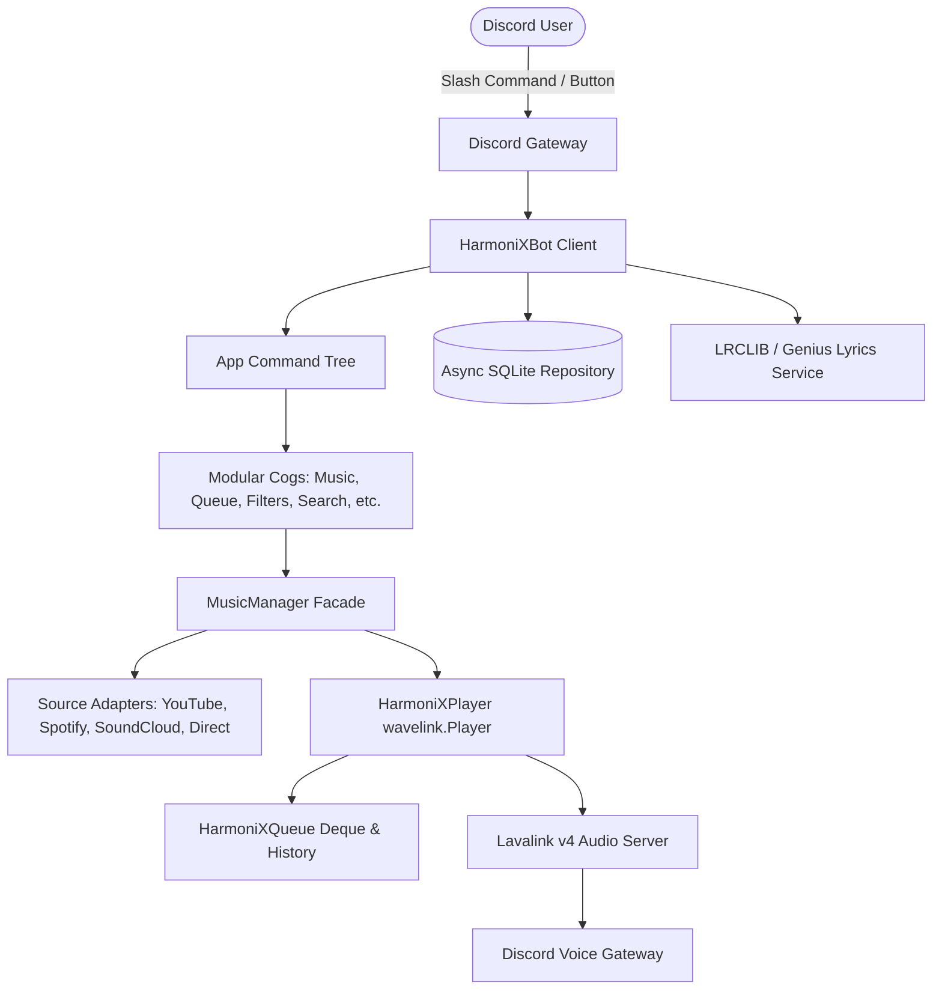

# 🎵 HarmoniX - Advanced Discord Music Platform

[](https://www.python.org/downloads/)
[](https://discordpy.readthedocs.io/)
[](https://github.com/lavalink-devs/Lavalink)
[](https://railway.com)
[](LICENSE)
[]()

**HarmoniX** is a high-fidelity, production-grade Discord Music Bot engineered in Python using **discord.py 2.x**, **Wavelink 3.x**, and **Lavalink v4**. Designed as a modern alternative to platforms like Hydra and Jockie Music, HarmoniX provides dynamic UI control dashboards, multi-source stream resolution, 24/7 channel presence, custom playlist databases, real-time audio DSP filters, and robust per-guild queue management.

---

## 📑 Table of Contents

- [Features](#-features)
- [Architecture Overview](#-architecture-overview)
- [Project Directory Structure](#-project-directory-structure)
- [Requirements](#-requirements)
- [Installation & Setup](#-installation--setup)
  - [1. Discord Developer Portal Setup](#1-discord-developer-portal-setup)
  - [2. Local Installation (Windows & Linux)](#2-local-installation-windows--linux)
  - [3. Running Lavalink v4 Server](#3-running-lavalink-v4-server)
  - [4. Docker & Docker Compose Deployment](#4-docker--docker-compose-deployment)
- [Configuration (.env)](#-configuration-env)
- [Command Reference](#-command-reference)
- [Audio Filters & Equalizer](#-audio-filters--equalizer)
- [Database & Storage](#-database--storage)
- [Running Tests](#-running-tests)
- [Troubleshooting Guide](#-troubleshooting-guide)
- [License](#-license)

---

## 🌟 Features

### 🎧 High-Fidelity Audio Engine
- **Lavalink v4 Backend**: Minimal memory footprint, high concurrent stream processing, and stutter-free audio delivery.
- **Audio DSP Filters**: Live Bass Boost (Low, Medium, High), Nightcore, Vaporwave, 8D Binaural Rotating Audio, Karaoke vocal suppression, and Equalizer presets (Pop, Rock, Electronic, Flat).
- **Format & Source Diversity**: YouTube, YouTube Music, Spotify (metadata matching), SoundCloud, Apple Music, and direct HTTP/Icecast/Shoutcast radio streams.

### 🎛️ Dynamic Interactive UI
- **Persistent Now Playing Dashboard**: Interactive buttons for Play/Pause, Skip, Previous/Replay, Shuffle, Loop modes, Volume adjustment, and live filter dropdown menus.
- **Real-Time Progress Bars**: Visual track progression indicator (`01:24 🔘▬▬▬▬▬▬▬▬ 03:45`).
- **Interactive Track Search**: Choose between search results using Discord Select Dropdowns (`/search <query>`).
- **Paginated Queue & Lyrics Viewers**: Easily flip through song queues and synchronized/plain lyrics.

### 📑 Advanced Queue System
- **Thread-safe Deque**: Concurrency-guarded operations preventing race conditions.
- **Loop Modes**: Off, Track Loop, and Entire Queue Loop.
- **History Tracking**: Jump backwards to previous songs from playback history.
- **Queue Persistence**: Save (`/queue save <name>`) and restore (`/queue load <name>`) server queues directly to database.

### 🛡️ DJ & Permission Management
- Server owner and administrator bypass.
- Configurable **DJ Role** for skip, stop, volume, and filter controls.
- **Solo Listener Bypass**: Lone listeners in voice channels are granted DJ controls automatically.
- Same voice channel enforcement.

### 📻 24/7 Radio & Presence
- Curated presets: Lofi Hip Hop, Synthwave/Retrowave, Smooth Jazz, Classic Rock, Chillout Lounge.
- 24/7 continuous channel presence (`/247`) preventing auto-disconnect.
- Configurable inactivity timeout auto-leave when empty or idle.

---

## 🏗️ Architecture Overview



---

## 📂 Project Directory Structure

```text
harmonix_bot/
│
├── main.py                     # Main application entrypoint
├── requirements.txt            # Production Python dependencies
├── .env.example                # Environment variable template
├── .gitignore                  # Git ignore rules
├── Dockerfile                  # Production container build
├── docker-compose.yml          # Container orchestration (Bot + Lavalink)
├── LICENSE                     # MIT License
│
├── config/                     # Configuration management
│   ├── __init__.py
│   └── settings.py             # Pydantic Settings model
│
├── bot/                        # Bot client & error infrastructure
│   ├── __init__.py
│   ├── client.py               # HarmoniXBot (commands.Bot subclass)
│   ├── events.py               # Gateway & Wavelink event listeners
│   └── errors.py               # Unified exception hierarchy
│
├── cogs/                       # Modular slash command extensions
│   ├── __init__.py
│   ├── music.py                # Play, pause, resume, skip, seek, volume, 247
│   ├── player.py               # Control panel refresh and track metadata
│   ├── queue.py                # Queue management, shuffle, move, save, load
│   ├── search.py               # Interactive dropdown track search
│   ├── lyrics.py               # Paginated lyrics provider
│   ├── filters.py              # Equalizer and DSP audio effects
│   ├── radio.py                # Live web radio streams & curated presets
│   ├── favorites.py            # User favorites bookmarks
│   ├── playlists.py            # Personal custom playlists
│   ├── settings.py             # Server configuration dashboard
│   ├── admin.py                # System diagnostics, node ping, health checks
│   └── help.py                 # Categorized interactive help guide
│
├── music/                      # Audio engine core
│   ├── __init__.py
│   ├── manager.py              # Source dispatcher & player factory
│   ├── player.py               # HarmoniXPlayer (wavelink.Player)
│   ├── queue.py                # Safe deque, history, and loop controls
│   ├── track.py                # HarmoniXTrack wrapper
│   ├── filters.py              # Lavalink filter presets
│   └── sources/                # Source adapters
│       ├── __init__.py
│       ├── base.py             # Abstract base adapter
│       ├── youtube.py          # YouTube & YouTube Music
│       ├── spotify.py          # Spotify Web API & metadata resolver
│       ├── soundcloud.py       # SoundCloud stream resolver
│       ├── apple_music.py      # Apple Music resolver
│       └── direct_url.py       # Direct MP3/AAC/radio streams
│
├── services/                   # Background integrations
│   ├── __init__.py
│   ├── lyrics.py               # LRCLIB & Genius integration
│   ├── metadata.py             # Track info extractor
│   ├── recommendations.py      # Autoplay recommendation engine
│   └── statistics.py           # Uptime and system metrics
│
├── database/                   # Storage engine
│   ├── __init__.py
│   ├── models.py               # Dataclass entity definitions
│   ├── connection.py           # Async SQLite connection & schema migrations
│   └── repository.py           # MusicRepository CRUD operations
│
├── ui/                         # Discord UI components
│   ├── __init__.py
│   ├── embeds.py               # Rich branded embeds
│   ├── views.py                # Interactive button views & select menus
│   ├── buttons.py              # Component buttons
│   └── modals.py               # Volume, Seek, and Playlist modals
│
├── utils/                      # Utilities
│   ├── __init__.py
│   ├── logging.py              # Rotating logs & credential scrubber
│   ├── permissions.py          # DJ roles & voice channel checks
│   ├── validators.py           # URL & time format parsers
│   └── cooldowns.py            # Command rate limiting
│
├── lavalink/                   # Lavalink Server assets
│   └── application.yml         # Lavalink v4 configuration with plugins
│
└── tests/                      # Automated test suite
    ├── __init__.py
    ├── conftest.py             # Shared mock fixtures
    ├── test_queue.py           # Queue unit tests
    ├── test_permissions.py     # Permission check tests
    ├── test_sources.py         # URL and validator tests
    └── test_player.py          # Player, filter, and DB tests
```

---

## 💻 Requirements

- **Python 3.10+** (Python 3.11 recommended)
- **Java 17+** (Required only if self-hosting Lavalink outside Docker)
- **Lavalink v4** (Or a remote Lavalink v4 node)
- **Discord Bot Token** with `Message Content`, `Server Members`, and `Voice States` Privileged Gateway Intents enabled.

---

## 🚀 Installation & Setup

### 1. Discord Developer Portal Setup
1. Visit the [Discord Developer Portal](https://discord.com/developers/applications) and create a **New Application**.
2. Navigate to the **Bot** tab:
   - Click **Reset Token** to copy your **Bot Token**.
   - Under **Privileged Gateway Intents**, enable:
     - ✅ **Presence Intent** (optional)
     - ✅ **Server Members Intent**
     - ✅ **Message Content Intent**
3. Navigate to **OAuth2 -> URL Generator**:
   - Select scope: `bot` and `applications.commands`
   - Select permissions:
     - `Connect`, `Speak`, `Use Voice Activity`, `Send Messages`, `Embed Links`, `Attach Files`, `Read Message History`, `Manage Messages`.
   - Copy the generated URL to invite HarmoniX to your Discord server.

---

### 2. Local Installation (Windows & Linux)

#### Clone and Install Dependencies
```bash
# Clone the repository
git clone https://github.com/your-repo/harmonix-music-bot.git
cd "harmonix-music-bot"

# Create and activate a virtual environment
python -m venv .venv

# On Windows:
.venv\Scripts\activate

# On Linux/macOS:
source .venv/bin/activate

# Install required packages
pip install -r requirements.txt
```

#### Configure Environment Variables
Copy `.env.example` to `.env`:
```bash
cp .env.example .env
```
Open `.env` and fill in:
```env
DISCORD_TOKEN=your_actual_bot_token_here
LAVALINK_URI=http://127.0.0.1:2333
LAVALINK_PASSWORD=youshallnotpass
```

---

### 3. Running Lavalink v4 Server

Lavalink is the high-performance audio engine.

#### Option A: Running via Docker (Easiest)
```bash
docker run -d \
  --name lavalink \
  -p 2333:2333 \
  -v $(pwd)/lavalink/application.yml:/opt/Lavalink/application.yml \
  ghcr.io/lavalink-devs/lavalink:4
```

#### Option B: Standalone Java Executable
1. Ensure Java 17 or higher is installed (`java -version`).
2. Download `Lavalink.jar` from [Lavalink Releases](https://github.com/lavalink-devs/Lavalink/releases).
3. Place `Lavalink.jar` in the `lavalink/` directory alongside `application.yml`.
4. Run:
   ```bash
   cd lavalink
   java -jar Lavalink.jar
   ```

---

### 4. Docker & Docker Compose Deployment

The fastest way to deploy HarmoniX in production with Lavalink:

```bash
# 1. Edit .env with your DISCORD_TOKEN
# 2. Build and launch both containers
docker-compose up -d --build

# Inspect logs
docker-compose logs -f
```

---

### 5. 🚆 24/7 Cloud Hosting on Railway (Recommended)

HarmoniX includes native **Railway** support with an all-in-one multi-stage container that runs **both Lavalink v4 (Java 21) and the Discord bot (Python 3.11)** together:

1. Push your code to your GitHub account (`git push origin main`).
2. Go to [Railway](https://railway.com) and click **+ New Project** → **Deploy from GitHub repo**.
3. Select your repository.
4. Add the **`DISCORD_TOKEN`** variable in the **Variables** tab.
5. (Optional) Under **Volumes**, add a persistent volume mounted to `/app/data` to persist playlists and settings across deploys.

👉 **For detailed instructions and tips, read the [Railway Deployment Guide](RAILWAY.md).**

---

## ⚙️ Configuration (.env)

| Variable | Default | Description |
|---|---|---|
| `DISCORD_TOKEN` | *(Required)* | Discord Bot Application Token |
| `DEFAULT_PREFIX` | `!` | Text prefix for fallback commands |
| `BOT_NAME` | `HarmoniX` | Display brand name |
| `LAVALINK_URI` | `http://127.0.0.1:2333` | Address of the Lavalink node |
| `LAVALINK_PASSWORD` | `youshallnotpass` | Lavalink node authentication password |
| `SPOTIFY_CLIENT_ID` | `None` | (Optional) Spotify Developer API Client ID |
| `SPOTIFY_CLIENT_SECRET`| `None` | (Optional) Spotify Developer API Secret |
| `GENIUS_API_TOKEN` | `None` | (Optional) Genius API token for lyrics fallback |
| `DEFAULT_VOLUME` | `80` | Default volume for newly created players (0-100) |
| `MAX_QUEUE_SIZE` | `500` | Maximum songs allowed in queue |
| `AUTO_LEAVE_SECONDS` | `180` | Inactivity countdown before bot leaves voice |

---

## 📖 Command Reference

### 🎵 Playback (`/`)
- `/play <query>` — Enqueue a song, album, playlist, or stream (YouTube, Spotify, SoundCloud, direct URLs).
- `/pause` — Pause current playback.
- `/resume` — Resume paused audio.
- `/skip` — Skip to next track in queue.
- `/previous` — Replay previous track from history.
- `/replay` — Restart current track from beginning.
- `/stop` — Stop playback and clear the queue.
- `/volume <0-100>` — Set volume.
- `/seek <timestamp>` — Seek to time (e.g. `1:30` or `90s`).
- `/nowplaying` — Open the interactive Now Playing dashboard.
- `/autoplay` — Toggle automatic recommendation playback when queue ends.
- `/247` — Toggle 24/7 continuous voice presence.
- `/join` — Connect bot to voice channel.
- `/leave` — Disconnect bot from voice.

### 📑 Queue Management (`/queue`)
- `/queue show [page]` — Display paginated server queue.
- `/queue clear` — Empty all songs from queue.
- `/queue shuffle` — Randomize upcoming tracks.
- `/queue remove <index>` — Remove track by position.
- `/queue move <from> <to>` — Move track to a new slot.
- `/queue jump <index>` — Skip directly to position.
- `/queue reverse` — Reverse queue order.
- `/queue loop <off|track|queue>` — Change loop mode.
- `/queue history` — Show recently played tracks.
- `/queue save <name>` — Save current queue to database.
- `/queue load <name>` — Load saved queue from database.

### 🎛️ Audio Filters (`/filter`)
- `/filter bassboost <low|med|high>` — Apply frequency equalizer bass boost.
- `/filter nightcore` — 1.3x speed with pitched vocals.
- `/filter vaporwave` — 0.85x speed with deep slow pitch.
- `/filter 8d` — Stereo 360-degree rotating binaural effect.
- `/filter karaoke` — Suppress vocal band for sing-alongs.
- `/filter clear` — Reset all filters to flat.

### 🔍 Discovery & Utilities
- `/search <query>` — Interactive top 10 search results dropdown.
- `/lyrics [query]` — Paginated plain & synced lyrics from LRCLIB / Genius.
- `/trackinfo [query]` — Detailed track, artist, album, and length metadata.
- `/radio play [preset|url]` — Broadcast curated 24/7 radio presets or streams.
- `/radio list` — List available radio stations.

### ⭐ Favorites & Playlists
- `/favorite add [query]` — Bookmark song to your personal favorites.
- `/favorite list` — View your favorite tracks.
- `/favorite play` — Queue all your favorites.
- `/favorite remove <title>` — Remove a favorite.
- `/playlist create <name>` — Create a custom personal playlist.
- `/playlist add <name> [query]` — Add track to playlist.
- `/playlist play <name>` — Enqueue entire playlist.
- `/playlist list` — List your playlists.
- `/playlist delete <name>` — Delete playlist.

### ⚙️ Server Configuration (`/settings`)
- `/settings view` — Inspect server configuration.
- `/settings dj-role [role]` — Assign DJ role for music commands.
- `/settings default-volume <0-100>` — Change default volume.
- `/settings max-queue <10-2000>` — Set maximum queue capacity.
- `/settings auto-leave <bool>` — Toggle inactivity auto-disconnect.
- `/settings reset` — Restore server defaults.

### ⚡ System & Diagnostics
- `/status` — View memory, CPU, uptime, and Lavalink node health.
- `/ping` — Measure Discord Gateway and Lavalink audio latency.
- `/help` — Interactive categorized command guide.

---

## 🧪 Running Tests

The test suite validates queue algorithms, permission logic, source routing, audio filter configurations, and database repository operations:

```bash
# Execute pytest
python -m pytest -v
```

All 19 tests run with zero external network dependencies using mock fixtures.

---

## 🔧 Troubleshooting Guide

### 1. `LavalinkUnavailableError: Audio backend node is currently unavailable`
- Ensure your Lavalink v4 server is running on `127.0.0.1:2333` (or the URI configured in `.env`).
- Verify password matches `LAVALINK_PASSWORD` in `.env` and `application.yml`.
- Check `lavalink/logs/` or container logs (`docker logs harmonix-lavalink`).

### 2. `Bot connects but no audio is heard`
- Ensure the bot has `Speak` and `Connect` permissions in the voice channel.
- Check that the Lavalink node is healthy (`/status`).
- If streaming YouTube, ensure the `youtube-plugin` is present and active in Lavalink.

### 3. `Interaction failed / Slash commands not appearing`
- Global slash commands can take a few minutes to propagate across Discord after the first sync.
- Run `/status` or check console logs to confirm `Synced X global application slash commands`.
- Ensure `applications.commands` scope was checked when generating the bot invite link.

---

## 📄 License

HarmoniX is open-source software licensed under the [MIT License](LICENSE).
